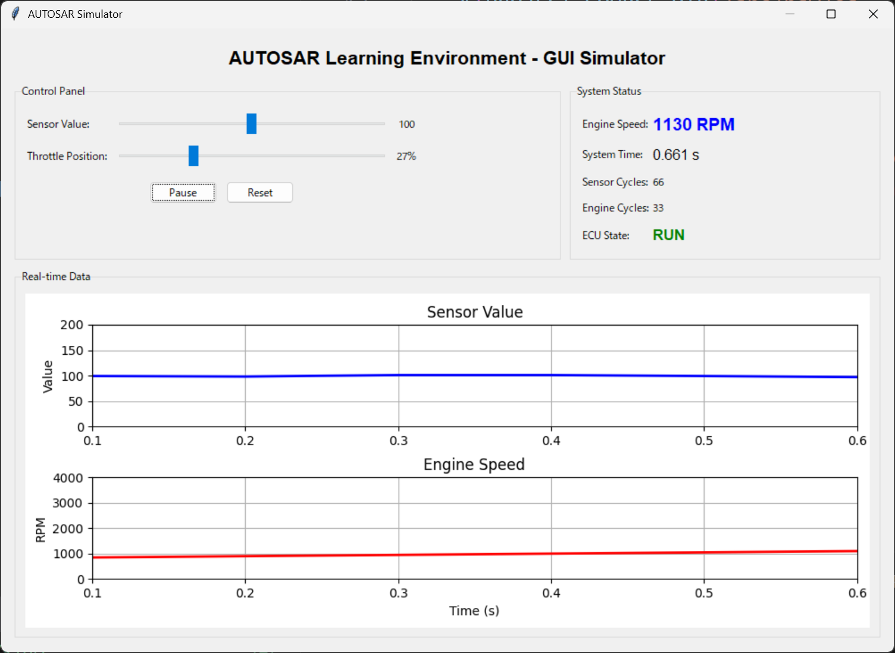

# AUTOSAR 学習環境

[](https://opensource.org/licenses/MIT)
[](https://en.wikipedia.org/wiki/C_(programming_language))
[](https://www.python.org/)

AUTOSAR（AUTomotive Open System ARchitecture）の基本概念を学ぶための簡易実装環境です。

[English README](README.md)

## 🎯 概要

この環境は、本格的なAUTOSARツールチェーンを使わずに、AUTOSAR標準の基本構造と動作原理を理解するための教育的な実装です。学生やエンジニア、自動車ソフトウェアアーキテクチャに興味がある方に最適です。

### 特徴

- ✅ **完全なAUTOSAR階層アーキテクチャ**（BSW、RTE、SWC）
- ✅ **タスクスケジューラ**による周期的タスク実行
- ✅ **RTE経由のコンポーネント間通信**
- ✅ **インタラクティブGUIシミュレータ**によるリアルタイム可視化
- ✅ **完全にドキュメント化**された学習ガイド付きコード
- ✅ **クロスプラットフォーム**（Windows、Linux、macOS）

## 🏗️ AUTOSARアーキテクチャ

```
┌─────────────────────────────────────┐
│   Application Layer (SWC)           │  アプリケーション層
│   - EngineControl                   │
│   - SensorReader                    │
└─────────────────────────────────────┘
            ↕ (RTE API)
┌─────────────────────────────────────┐
│   RTE (Runtime Environment)         │  実行時環境
└─────────────────────────────────────┘
            ↕
┌─────────────────────────────────────┐
│   Basic Software (BSW)              │  基本ソフトウェア
│   ├─ OS (Operating System)          │
│   ├─ Com (Communication)            │
│   ├─ EcuM (ECU Manager)             │
│   └─ Det (Diagnostic)               │
└─────────────────────────────────────┘
            ↕
┌─────────────────────────────────────┐
│   MCAL (シミュレーション実装)        │  マイコン抽象化層
└─────────────────────────────────────┘
```

## 📁 ディレクトリ構成

```
AutosarTest/
├── src/
│   ├── bsw/              # 基本ソフトウェア層
│   │   ├── os/           # オペレーティングシステム
│   │   ├── com/          # 通信
│   │   ├── ecum/         # ECUマネージャ
│   │   └── det/          # 診断イベントマネージャ
│   ├── rte/              # 実行時環境
│   ├── swc/              # ソフトウェアコンポーネント
│   │   ├── EngineControl/
│   │   └── SensorReader/
│   └── main.c            # メインエントリポイント
├── config/               # 設定ファイル
├── docs/                 # ドキュメント
├── simulator_gui.py      # Python GUIシミュレータ
├── CMakeLists.txt        # ビルド設定
└── README.md             # このファイル
```

## 🚀 クイックスタート

### 方法1: Cコンソールシミュレータ

**必要な環境:**
- CMake 3.10以上
- Cコンパイラ（GCC、Clang、MSVC）

**ビルドと実行:**

```bash
# Windows (PowerShell)
.\build.ps1
.\run.ps1

# Linux/macOS
./build.sh
./run.sh
```

**手動ビルド:**

```bash
mkdir build && cd build
cmake ..
cmake --build .
./AutosarSim          # Linux/macOS
.\Debug\AutosarSim.exe   # Windows
```

### 方法2: Python GUIシミュレータ（推奨）

**必要な環境:**
- Python 3.7以上
- matplotlib

**実行:**

```bash
# Windows
.\run_gui.ps1

# Linux/macOS
./run_gui.sh

# または手動で
pip install matplotlib
python simulator_gui.py
```

## 📸 スクリーンショット

### GUIシミュレータ



リアルタイム制御と可視化機能を持つインタラクティブなグラフィカルインターフェース：
- **コントロールパネル**: センサー値とスロットル位置の調整可能なスライダー
- **システムステータス**: エンジン回転数、システム時間、タスクサイクル、ECU状態のリアルタイム表示
- **ライブグラフ**: センサー値とエンジン回転数の時系列リアルタイムプロット
- **Start/Pause/Resetコントロール**: シミュレーション実行の完全な制御

### コンソールシミュレータ
リアルタイムのタスク実行とシグナル通信を表示：

```
========================================
  AUTOSAR Learning Environment
  Simple ECU Simulation
========================================

=== STARTUP PHASE ===
[ECUM] ECU State Manager Initializing...
[DET] Initialized
[COM] Initialized
[OS] Initialized
...
```

## 📚 学習ポイント

1. **レイヤードアーキテクチャ**: AUTOSAR標準の階層構造を理解
2. **RTE（実行時環境）**: アプリケーションとBSW間のインターフェース
3. **タスクスケジューリング**: OSによる周期的タスク実行
4. **通信**: ソフトウェアコンポーネント間のデータ交換
5. **設定管理**: 静的設定による動作カスタマイズ

## 🎓 学べること

### 基本ソフトウェア層（BSW）
- **OS**: 簡易周期タスクスケジューラ（1msティック）
- **Com**: シグナルベースのコンポーネント間通信
- **EcuM**: ECUライフサイクル管理（起動 → 実行 → シャットダウン）
- **Det**: 開発時エラー検出とレポート

### 実行時環境（RTE）
- SWCとBSW間のポートベース抽象化
- Sender-Receiver通信パターン
- データ整合性と同期

### ソフトウェアコンポーネント（SWC）
- **SensorReader**: センサーデータ読み取り（10ms周期）
- **EngineControl**: センサー入力に基づくエンジン制御（20ms周期）
- 独立した、ハードウェア非依存のアプリケーションロジック

## 📖 ドキュメント

- [学習ガイド](docs/learning_guide.md) - ステップバイステップチュートリアル
- [アーキテクチャ詳細](docs/architecture.md) - 詳細なアーキテクチャ説明
- [ビルド手順](docs/build_instructions.md) - 詳細なビルド手順
- [GUIシミュレータガイド](docs/gui_simulator.md) - Python GUIドキュメント
- [用語集](docs/glossary.md) - AUTOSAR用語集

## 🔧 プロジェクトの拡張

### 初級
- [ ] 新しいセンサーSWCの追加
- [ ] 異なるタスク周期の実装
- [ ] エラー処理の強化

### 中級
- [ ] Client-Server通信の実装
- [ ] イベント駆動タスクの追加
- [ ] メモリ管理モジュールの作成

### 上級
- [ ] CANバス通信のシミュレーション
- [ ] NVM（不揮発性メモリ）の実装
- [ ] UDS診断プロトコルの基礎実装

## 🌟 本格的なAUTOSARへの次のステップ

この学習環境に慣れたら：

1. **AUTOSAR仕様の学習**
   - Classic Platform 4.x
   - Adaptive Platform

2. **商用ツールの試用**
   - Vector MICROSAR
   - ETAS ISOLAR
   - EB tresos

3. **オープンソースの探求**
   - Arctic Core
   - AUTOSAR-OS

## 🤝 コントリビューション

コントリビューションを歓迎します！issueやpull requestをお気軽に提出してください。

## 📄 ライセンス

このプロジェクトはMITライセンスの下でライセンスされています。詳細は[LICENSE](LICENSE)ファイルをご覧ください。

## 🙏 謝辞

このプロジェクトはAUTOSAR概念の理解を助けるための教育目的で作成されました。AUTOSARコンソーシアムとは関係ありません。

## 📧 お問い合わせ

質問やフィードバックは、GitHubでissueを開いてください。

---

**注意**: これは簡易化された教育用実装です。実際の自動車用ソフトウェア開発には、認証されたAUTOSARツールを使用し、安全規格（ISO 26262、ASPICEなど）に従ってください。
